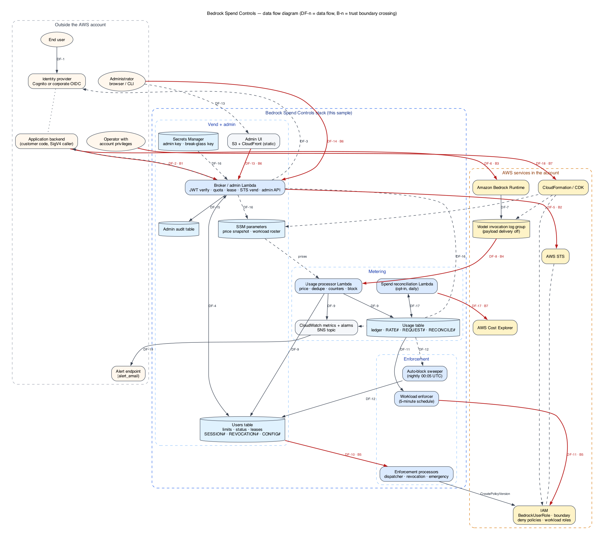

# Threat model

STRIDE review of Bedrock Spend Controls against its trust boundaries.
Every mitigation cites the file that implements
it; status is **Mitigated** (control exists and is tested), **Accepted**
(known residual risk, documented, not planned), or **Open** (no control;
listed so it is not forgotten). Each threat opens with its priority and a
one-sentence statement in the AWS threat grammar (*a source with
prerequisites can act, which leads to an impact, reducing a goal of some
assets*); the prose that follows is the reasoning.

Three files carry the same model. [`threat-model.json`](threat-model.json)
is the source of truth (boundaries, assets, assumptions, data flows,
threats), this document is its narrative, and
[`threat-model.tc.json`](threat-model.tc.json) is a
[Threat Composer](https://github.com/awslabs/threat-composer) workspace
generated from the JSON by `tools/threat_composer_export.py` for teams that
work in that tool. `tests/test_threat_model.py` fails when the three
disagree.

Last updated: 2026-09-15.

## What this system protects

The asset is **the Bedrock bill**, bounded per identity, tenant, or
workload. Confidentiality of prompts is out of scope by construction: the
broker never sees inference traffic, and the managed invocation-logging
configuration disables payload delivery. The integrity properties that
matter are (a) usage is attributed to the right subject, (b) a blocked
subject loses access within the documented bound, and (c) administrative
changes are authorized and audited.

## Trust boundaries

| # | Boundary | Crosses | Implemented by |
|---|---|---|---|
| B1 | Application / end user → broker | OIDC JWT in `X-Quota-User-Token`; SigV4 on the `AWS_IAM` Function URL | `gateway/app/auth.py`, `gateway/app/main.py:_authenticate`, `cdk/stacks/spend_controls_stack.py` Function URL + `invoker_principal_arns` |
| B2 | Broker → STS / IAM | `AssumeRole` with `RoleSessionName = SourceIdentity = sanitized claim`, inline session policy | `gateway/app/broker.py`, `gateway/app/session_policy.py`, `BedrockUserRole` + permissions boundary in the stack |
| B3 | Vended session → Bedrock | IAM authorization of `bedrock:InvokeModel*` / `CountTokens` on `allowed_model_arns`; invocation log is the metering truth | Role policy, boundary, session policy; Bedrock model-invocation logging |
| B4 | Invocation logs → usage processor → DynamoDB | CloudWatch Logs subscription; `identity.arn` and `modelId` from the record; transactional ledger writes | `usage_processor/handler.py` |
| B5 | DynamoDB streams → enforcement processors → IAM policy versions | `REVOCATION#` sentinels and `CONFIG#EMERGENCY_STOP`; `CreatePolicyVersion` on pre-attached policies; `PutRolePolicy` on workload roles | `enforcement_dispatcher/`, `revocation_processor/`, `emergency_processor/`, `workload_enforcer/` |
| B6 | Admin UI / API → admin mutations | Shared admin key or admin JWT claim; separate break-glass key; `If-Match` + `Idempotency-Key` | `gateway/app/main.py:_require_admin`, `_require_emergency_admin`, `gateway/app/quota.py` admin mutations, admin-audit table |
| B7 | Operator / account administrator → out-of-band IAM, SCP, logging config | Console/CLI with account privileges | Not controllable by the sample; `DenyDirectBedrockPolicy`, SCP guidance |

## Data flow diagram

Dashed regions are trust zones; red arrows are the boundary crossings
`B1`–`B7` from the table above, labelled with the data flow `DF-n` they
carry. The source is [`assets/data-flow.dot`](../assets/data-flow.dot);
`tools/render_data_flow.py` regenerates the PNG and the *Data flow (trust
boundaries)* page of [`assets/architecture.drawio`](../assets/architecture.drawio)
from it.

## Assets

| # | Asset | What it is | Goals |
|---|---|---|---|
| A-1 | **Bedrock spend** | The account's Bedrock bill, bounded per user identity, tenant, or workload. The primary asset: every other asset matters because it protects this one. | economy |
| A-2 | **vended credentials** | Short-lived STS sessions for BedrockUserRole carrying RoleSessionName = SourceIdentity = the sanitized identity claim and a lease-deadline session policy. | integrity, confidentiality |
| A-3 | **usage ledger** | Usage table: canonical daily rows, per-model rows, RATE# minute counters, REQUEST# idempotency markers, and stored RECONCILE# runs. | integrity, availability |
| A-4 | **quota configuration and subject status** | Users table: limits, thresholds, model budgets, status and status_origin, logical leases, SESSION# maps, REVOCATION# sentinels, CONFIG# control rows. | integrity, availability |
| A-5 | **administrative secrets** | Routine admin key and break-glass emergency key in Secrets Manager; the admin JWT claim/value configuration that gates the console. | confidentiality |
| A-6 | **enforcement IAM policies** | Per-user SourceIdentity deny shards, emergency deny policy versions, workload inline denies, the permissions boundary, and BedrockUserRole itself. | integrity, availability |
| A-7 | **administrative audit trail** | Admin audit table events and idempotency records; CONFIG#ENFORCEMENT_AUDIT# and EMERGENCY_AUDIT# rows. | integrity |
| A-8 | **metering source** | Bedrock model invocation logging configuration, the managed log group, and the CloudWatch Logs subscription to the usage processor. | integrity, availability |
| A-9 | **price catalog and workload roster** | The reviewed price catalog and per-model overrides (configuration.py), the SSM price snapshot, and the SSM workload roster the console reads. | integrity, confidentiality |
| A-10 | **account cost data** | Aggregate Bedrock cost for the Region read from Cost Explorer by the opt-in reconciliation Lambda and stored as RECONCILE# rows. | confidentiality |

*Out of scope:* Prompts and completions: the broker never sees inference traffic and the logging configuration disables payload delivery, so their confidentiality is not a property this sample can affect.

## Assumptions

| # | Assumption | Underpins |
|---|---|---|
| AS-1 | The identity provider is trusted and the attribute configured as jwt_user_claim is stable and not editable by the end user (the default sub is safe). Group membership behind admin_jwt_claim is managed by the IdP administrators. | T-02, T-22 |
| AS-2 | Account administrators (IAM, SCP, Bedrock logging configuration, DynamoDB console) are trusted. The sample cannot constrain the account's management plane; production applies the SCP or DenyDirectBedrockPolicy and relies on CloudTrail for administrator accountability. | T-12, T-26, T-27 |
| AS-3 | Model invocation logging is the metering truth: identity.arn, modelId, requestId, and token counts are populated by the Bedrock service and cannot be forged by the caller. requestMetadata is caller-controlled and is never used for attribution. | T-09, T-14 |
| AS-4 | Model invocation logging does not capture StartAsyncInvoke, InvokeModelWithBidirectionalStream, or anything on the bedrock-mantle endpoint. Operators who need strict accounting exclude models used through those APIs from allowed_model_arns and deny bedrock-mantle:* alongside bedrock:*. | T-08, T-10, T-11 |
| AS-5 | End users reach Bedrock only through vended credentials; workload-mode applications call Bedrock with their own IAM role attributed by an application inference profile. No other principal in the account retains bedrock:InvokeModel* (production enforces this with an SCP). | T-26, T-19 |
| AS-6 | Overspend is bounded, not zero. The design guarantee is metering lag + min(lease remainder, deny propagation); real-time cut-off is not a goal, and the bound must be measured in the deploying account (see qualification/QUALIFICATION.md). | T-13, T-16, T-17 |
| AS-7 | Production restricts invoker_principal_arns so that only the application backends can call the broker Function URL; the broker is never exposed to anonymous callers, and token theft alone is insufficient to vend. | T-01, T-03 |
| AS-8 | The routine admin key and the break-glass key are held by operators, rotated per the gateway runbook, and never reach a browser: the console authorizes by admin JWT group and SigV4, and the break-glass key is typed per action. | T-21, T-24 |
| AS-9 | The reviewed price catalog and its overrides change only through Git review; the SSM price snapshot and workload roster are written only by CloudFormation, so a wrong price is a review failure rather than a runtime attack. | T-28, T-30 |
| AS-10 | Reconciliation is opt-in. When enabled it reads Cost Explorer for the settled day (reconcile_lag_days) and the cost-allocation tag has been activated at the payer account; Cost Explorer data is account-wide by nature. | T-29 |
| AS-11 | This is educational sample code, not a managed service: an adopter runs their own security review and adapts invoker_principal_arns, allowed_model_arns, the SCP, and alerting before production use. | T-26, T-27, T-24 |
| AS-12 | A SESSION# map row cannot be needed after the STS credential it describes has expired (at most 3 600 s), so a usage_retention_days TTL with a 31-day floor only loses attribution for records delivered days late. | T-15 |

## Data flows

| # | Boundary | From → to | Channel | Carries | Assets |
|---|---|---|---|---|---|
| DF-1 | outside | End user / application → Identity provider (Cognito or corporate OIDC) | OIDC login | identity JWT | — |
| DF-2 | B1 | Application backend → Broker Function URL | HTTPS, SigV4 (AWS_IAM) + X-Quota-User-Token | JWT in; vended credentials and quota headers out | A-2, A-4 |
| DF-3 | B1 | Broker → Identity provider discovery / JWKS | HTTPS only | public signing keys | — |
| DF-4 | internal | Broker → Users table | DynamoDB conditional writes | limits, status, VEND# rate counters, logical leases, SESSION# maps | A-4 |
| DF-5 | B2 | Broker → AWS STS | AssumeRole with RoleSessionName = SourceIdentity and inline session policy | temporary credentials for BedrockUserRole | A-2, A-6 |
| DF-6 | B3 | Application (vended session) → Amazon Bedrock Runtime | SigV4 with vended credentials: InvokeModel*, Converse*, CountTokens | inference traffic (payload out of scope), attributed by SourceIdentity | A-1, A-2 |
| DF-7 | B3/B4 | Amazon Bedrock → Model invocation log group | service-side logging, payload delivery disabled | identity.arn, modelId, requestId, token and image counts | A-8 |
| DF-8 | B4 | Model invocation log group → Usage processor | CloudWatch Logs subscription filter (at-least-once) | invocation records | A-8, A-3 |
| DF-9 | B4 | Usage processor → Usage table, Users table, CloudWatch, SNS | TransactWriteItems (REQUEST# marker + subject + per-model rows + RATE#); status update + REVOCATION# sentinel; EMF metrics; notifications | priced usage, block decisions, detection lag | A-3, A-4 |
| DF-10 | B5 | Users table stream → Enforcement dispatcher, revocation processor, emergency processor | DynamoDB Streams; iam:CreatePolicyVersion on pre-attached policies | REVOCATION# sentinels and CONFIG#EMERGENCY_STOP -> deny policy versions | A-6 |
| DF-11 | B5 | Workload enforcer (5-minute schedule) → Workload IAM roles | Ledger read; iam:PutRolePolicy scoped to the configured role ARNs | inline Bedrock deny for over-budget workloads | A-6, A-3 |
| DF-12 | B5 | Auto-block sweeper (nightly 00:05 UTC) → Users table, Usage table | Consistent filtered scan; TransactWriteItems conditional on version/status/reason | automatic blocks lifted to active + REVOCATION# sentinel | A-4 |
| DF-13 | B6 | Administrator (browser) → Admin UI (S3 + CloudFront) -> Cognito PKCE -> Identity Pool -> Broker admin endpoints | OIDC authorization code + PKCE; SigV4 with Identity Pool credentials; admin JWT group claim | quota changes, blocks, enforcement dial, live leases, audit reads | A-4, A-7 |
| DF-14 | B6 | Administrator / CLI → Broker admin endpoints | SigV4 + X-Admin-Key (Secrets Manager); break-glass key per emergency action; If-Match + Idempotency-Key | admin mutations | A-4, A-5, A-7 |
| DF-15 | internal | Broker → Admin audit table | Same transaction as the mutation | immutable audit events and idempotency records | A-7 |
| DF-16 | internal | Broker → CloudWatch alarms/metrics, SSM roster parameter, Secrets Manager | Read-only: DescribeAlarms, GetMetricData, GetParameter, GetSecretValue at cold start | operations view, workload roster, admin keys | A-5, A-9 |
| DF-17 | B7 | Spend reconciliation Lambda (opt-in, daily) → AWS Cost Explorer, Usage table | ce:GetCostAndUsage (resource *), ledger read, RECONCILE# write | aggregate and per-workload-tag Bedrock cost for the settled day | A-10, A-3 |
| DF-18 | B7 | Operator → CloudFormation / CDK | Deploy with account privileges | IAM roles, boundary, deny policies, logging configuration, SSM price snapshot and roster | A-6, A-8, A-9 |
| DF-19 | outside | SNS topic → Operator alert endpoint | SNS subscription (alert_email) | warnings, blocks, component failures | — |

## Threats

### B1 — Application / end user → broker

**T-01 · Spoofing · JWT forgery or replay.** Priority **Medium**.
> An external actor who has captured a valid user JWT before its expiry and
> also holds an IAM principal allowed on the broker Function URL can present
> the captured token to the broker, which leads to credentials vended under
> the victim's identity and spend charged to the victim's quota until the
> token expires, resulting in reduced integrity and economy of vended
> credentials, Bedrock spend and usage ledger.

An attacker presents a fabricated or captured token to obtain credentials
under another identity.
*Mitigation:* signature verified against the issuer's JWKS (RS/ES) or the
dev-only HS256 secret; `iss`, `aud` (any of the configured list), `exp`
enforced — `gateway/app/auth.py:JwtVerifier.verify`. Discovery and JWKS
URLs must be HTTPS (`test_auth.py::test_oidc_discovery_rejects_non_https_*`).
The lease deadline is capped at the token's `exp`
(`main.py:_reserve_permission_lease`, `expires_no_later_than=jwt_expiration`),
so a replayed token cannot mint credentials that outlive it.
*Residual:* a valid token stolen before `exp` is usable until then; there is
no `jti` replay cache. **Status: Accepted** — the caller must also hold an
IAM principal allowed on the Function URL (SigV4), so token theft alone is
insufficient.

**T-02 · Spoofing / Elevation · `jwt_user_claim` chosen or IdP misconfigured so
users control their own quota identity.** Priority **Medium**.
> An authenticated user whose IdP lets them edit the attribute configured as
> jwt_user_claim (for example a self-service preferred_username) can set
> their quota identity claim to another subject's value, which leads to
> spend accounted to and blocks applied against the wrong subject, resulting
> in reduced integrity and economy of usage ledger, quota configuration and
> subject status and Bedrock spend.

If the quota claim is user-editable at the IdP (e.g. a self-service
`preferred_username`), one user can spend another's budget.
*Mitigation:* none in code beyond rejecting reserved prefixes
(`quota.py:validate_user_id`, `RESERVED_USER_ID_PREFIXES`) and the
`workload:` namespace (`main.py:_authenticate`). Documentation directs
operators to a stable, IdP-controlled claim (DEPLOYMENT.md "Decisions
before deployment"). **Status: Accepted** — IdP configuration is outside the
sample; the default `sub` is safe.

**T-03 · Denial of service · Vend flooding.** Priority **Medium**.
> An authenticated client with a valid JWT and an allowed SigV4 principal
> can request credentials in a tight loop, which leads to STS AssumeRole
> throttling and DynamoDB write pressure that starve other users' vends,
> resulting in reduced availability of vended credentials.

A client refreshes credentials in a loop, exhausting STS (600 rps regional)
or DynamoDB.
*Mitigation:* per-identity vend rate limit
(`quota.py:_consume_vend_rate`, `VEND#<user>#<minute>` conditional
increment, `vend_rate_limit_per_minute`, default 6) → `429
lease_rate_limited`; logical lease refresh window
(`reserve_lease`, `LeaseNotRefreshable`) rejects a new lease ID before
`refresh_after`; Function URL requires a SigV4 principal from
`invoker_principal_arns`. **Status: Mitigated.** *Residual:* an attacker
holding many valid identities can multiply the per-identity budget; the
SigV4 requirement scopes who can try.

**T-04 · Information disclosure · Quota headers leak another user's state.** Priority **Low**.
> An authenticated user holding a vend response can read another subject's
> limits or usage from the quota response headers, which leads to disclosure
> of a third party's budget and consumption, resulting in reduced
> confidentiality of quota configuration and subject status and usage
> ledger.

*Mitigation:* headers describe only the authenticated identity's own limits
(`main.py:_quota_headers`). **Status: Mitigated.**

### B2 — Broker → STS / IAM

**T-05 · Spoofing · Session-name collision or injection.** Priority **High**.
> An authenticated user who can choose or influence an identity claim that
> sanitizes to another subject's RoleSessionName can obtain a session whose
> SourceIdentity maps to a different subject, which leads to usage credited
> to the wrong ledger row and revocation denies matching the wrong sessions,
> resulting in reduced integrity of usage ledger, enforcement IAM policies
> and vended credentials.

Two identities sanitize to the same `RoleSessionName`, or a crafted claim
breaks out of the session-name character set, so metering credits the wrong
subject or the revocation deny matches the wrong session.
*Mitigation:* `broker.py:session_name_for` derives a collision-resistant
name (sanitized prefix plus a hash of the full claim) and the same value is
set as `SourceIdentity`; the exact stamped value is persisted on the user
row (`quota.py:record_session`, `source_identity`) so the revocation
processor never re-derives it. Reverse map `SESSION#<name> → maps_to`.
`SetSourceIdentity` and `TagSession` are granted only to the broker role on
the trust policy (stack). **Status: Mitigated** (`tests/test_broker.py`).

**T-06 · Elevation · Session policy widens access.** Priority **High**.
> A holder of vended credentials whose lease session policy carries Resource
> "*" can invoke a model that is not in allowed_model_arns, which leads to
> unmetered or unpriced spend on models the operator never approved,
> resulting in reduced integrity and economy of Bedrock spend and
> enforcement IAM policies.

*Mitigation:* the session policy is `Allow bedrock:* Resource:"*"` with a
`DateLessThan aws:CurrentTime` condition; STS intersects it with the role
policy and the permissions boundary, so `"*"` cannot add a model absent from
`allowed_model_arns` (`session_policy.py` docstring; stack boundary). The
role grants exactly `bedrock:CountTokens`, `InvokeModel`,
`InvokeModelWithResponseStream`. **Status: Mitigated.**

**T-07 · Elevation · Bearer-token bypass of the model allowlist.** Priority **High**.
> A holder of vended credentials if bedrock:CallWithBearerToken were ever
> granted to the vended role can mint a Bedrock API key and call any model
> with it, which leads to defeat of the per-model ARN allowlist and of
> metering attribution, resulting in reduced integrity and economy of
> Bedrock spend, enforcement IAM policies and usage ledger.

`bedrock:CallWithBearerToken` requires `Resource:"*"` and would defeat the
per-model ARN allowlist.
*Mitigation:* not granted anywhere on the vended role, boundary, or session
policy; the `DenyDirectBedrockPolicy` and the SCP example explicitly deny it
for other principals (stack; DEPLOYMENT.md § Prevent bypass).
**Status: Mitigated.**

**T-08 · Elevation · `bedrock-mantle` endpoint bypass.** Priority **Medium**.
> A principal in the account holding bedrock-mantle:CreateInference or
> bedrock-mantle:CallWithBearerToken (a vended session never does; it is
> denied by omission) can run inference through the bedrock-mantle endpoint,
> which leads to spend that model-invocation logging never records,
> resulting in reduced integrity and economy of Bedrock spend and usage
> ledger.

Bedrock Mantle (`bedrock-mantle:CreateInference`, `bedrock-mantle:
CallWithBearerToken`) is a separate IAM service prefix and its calls are
**not captured by model-invocation logging** (Bedrock docs, "Monitor model
invocation using CloudWatch Logs and Amazon S3"). If reachable, spend is
invisible to metering.
*Analysis:* the vended
role's identity policy, the permissions boundary, and the session policy
grant only `bedrock:*` actions. A vended session therefore has **no**
`bedrock-mantle:*` permission and is denied by omission — the boundary
guarantees that even a future policy edit on the role cannot add it without
also editing the boundary. **Status: Mitigated for vended sessions.**
*Residual:* any *other* principal in the account with `bedrock-mantle:*`
spends unmetered; the `DenyDirectBedrockPolicy` and SCP example cover only
`bedrock:*` and should be extended with `bedrock-mantle:CreateInference` and
`bedrock-mantle:CallWithBearerToken` where Mantle is not wanted.
**Status (other principals): Accepted, documented** — see README
"Metering coverage caveat" and B7.

### B3 — Vended session → Bedrock

**T-09 · Repudiation / Tampering · `requestMetadata` spoofing.** Priority **Medium**.
> An authenticated caller with vended credentials can populate
> requestMetadata with another subject's identifier, which leads to
> misattributed usage if the metadata were trusted for accounting, resulting
> in reduced integrity of usage ledger.

The caller controls `requestMetadata` in the invocation log.
*Mitigation:* never read for attribution; the processor uses only
`identity.arn` (Bedrock-populated) and `modelId`
(`usage_processor/handler.py:_parse_invocation`). README "Identity" states
it is not trusted. **Status: Mitigated.**

**T-10 · Tampering · Unmetered Runtime APIs.** Priority **Medium**.
> A holder of vended credentials whose allowed_model_arns includes a model
> reachable through StartAsyncInvoke or InvokeModelWithBidirectionalStream
> can generate video, images, or speech through those APIs, which leads to
> spend that produces no invocation-log record and never reaches the ledger,
> resulting in reduced integrity and economy of Bedrock spend and usage
> ledger.

`StartAsyncInvoke` and `InvokeModelWithBidirectionalStream` authorize under
`bedrock:InvokeModel*` but produce no invocation-log record.
*Mitigation:* none possible in the data plane. Documented with the
recommendation to exclude such models from `allowed_model_arns`
(README "Metering coverage caveat"; the reconciliation delta runbook lists
it as a cause). **Status: Accepted.**

**T-11 · Tampering · Image generation priced at zero when image delivery is
off.** Priority **Low**.
> A holder of vended credentials calling an image model while
> imageDataDeliveryEnabled is false on the logging configuration can
> generate images whose log record carries neither token counts nor a body,
> which leads to requests counted but priced at $0 with no
> unpriced-dimension flag to alarm on, resulting in reduced integrity and
> economy of Bedrock spend and usage ledger.

A real Nova Canvas record with `imageDataDeliveryEnabled: false`
carries neither token counts nor a body, so `images: 0` and cost `$0` with
no `missing_dimensions` flag (nothing was present to flag).
*Mitigation:* the record is still counted as a request (`_is_image_model`
prevents it from being skipped as metadata-less) so the volume is visible;
README "Priced dimensions" caveat tells operators to enable image delivery
or exclude image models. **Status: Accepted** — flagged as the one pricing
gap the fallback alarm cannot detect.

### B4 — Invocation logs → usage processor → DynamoDB

**T-12 · Tampering · Log tampering or deletion by an account administrator.** Priority **High**.
> An account administrator with logs:DeleteLogGroup or
> bedrock:PutModelInvocationLoggingConfiguration can disable, redirect, or
> delete the invocation log, which leads to metering going blind while spend
> continues, resulting in reduced integrity and availability of metering
> source, usage ledger and Bedrock spend.

Someone with `logs:DeleteLogGroup` / `PutModelInvocationLoggingConfiguration`
removes or redirects the metering source.
*Mitigation:* the managed log group and logging configuration have
`RemovalPolicy.RETAIN`; the writer role's trust policy is condition-scoped
to `aws:SourceAccount` and `aws:SourceArn` (stack). Nothing prevents an
administrator from turning logging off. **Status: Accepted** — see B7. The
opt-in reconciliation (`reconciliation_enabled`, `reconciliation_processor/`)
is the detection control: a growing positive bill-minus-ledger gap is the
observable symptom.

**T-13 · Denial of service · Metering lag or stream lag leading to overspend.** Priority **Medium**.
> A holder of vended credentials already at a block threshold while log
> delivery or stream processing is delayed can keep invoking models during
> the detection window, which leads to spend above the budget up to metering
> lag + min(lease remainder, deny propagation), resulting in reduced economy
> of Bedrock spend.

Slow log delivery or a backed-up subscription delays detection.
*Mitigation:* overspend is bounded by construction:
`metering lag + min(lease remainder, deny propagation)` (README
"Enforcement guarantee"); the lease deadline is embedded in the credential
and cannot be extended (`session_policy.py`; `quota.py:reserve_lease`
non-extending retries); `DetectionLagMilliseconds` is measured per record
and shown on the Operations tab. **Status: Mitigated (bounded).**
*Residual:* the bound must be measured in the deploying account
(`qualification/QUALIFICATION.md`), and workload mode has no lease
— see T-19.

**T-14 · Tampering · Double-charging or lost increments on retry.** Priority **Medium**.
> A duplicate or partial log delivery when the CloudWatch Logs subscription
> retries a batch that was already applied can apply the same invocation
> record twice or lose an increment, which leads to inflated usage that
> blocks a subject early, or usage that is never charged, resulting in
> reduced integrity of usage ledger and quota configuration and subject
> status.

CloudWatch Logs delivery is at-least-once.
*Mitigation:* one `TransactWriteItems` with a conditional `REQUEST#<id>`
marker Put plus the subject and per-model ledger Updates; a cancelled
transaction re-reads the marker before classifying as duplicate
(`handler.py:_apply_usage`). **Status: Mitigated**
(`test_duplicate_delivery_is_idempotent`, `test_duplicate_request_skips_both_subject_and_model_rows`).

**T-15 · Elevation · Unresolved session → usage silently lost.** Priority **Low**.
> A late-delivered invocation record arriving after its SESSION# map row has
> expired (TTL usage_retention_days, floor 31 days) can reach the processor
> without a resolvable subject, which leads to usage that is logged as
> unresolved and never charged to anyone, resulting in reduced integrity and
> economy of usage ledger and Bedrock spend.

A `SESSION#` map row expired (TTL = `usage_retention_days`) so the record
cannot be attributed.
*Mitigation:* logged as `unresolved_sessions` warning; retention floor is 31
days. **Status: Accepted** — a session cannot outlive the vended STS
credential (≤ 3 600 s), so this only happens for records delivered days late.

### B5 — DynamoDB streams → enforcement processors → IAM

**T-16 · Tampering · IAM eventual consistency.** Priority **Low**.
> A blocked user holding live vended credentials in the seconds after
> CreatePolicyVersion succeeds can keep invoking models until the deny
> propagates, which leads to spend inside the documented propagation window,
> resulting in reduced economy of Bedrock spend.

A `CreatePolicyVersion` succeeds but takes seconds to propagate; sessions
keep working meanwhile.
*Mitigation:* propagation is inside the documented bound; the lease is the
fallback. **Status: Accepted (bounded).**

**T-17 · Denial of service · Revocation shard overflow.** Priority **Medium**.
> An actor controlling many identities able to drive many subjects over
> quota so that their SourceIdentity values land in one 6 144-character deny
> shard can fill the shard past the IAM policy size limit, which leads to
> new identities hashed to that shard not being IAM-cut (the lease bound
> still applies), resulting in reduced availability and economy of
> enforcement IAM policies and Bedrock spend.

Blocking many identities (legitimately, or by an attacker who can trigger
blocks for many identities they control) fills a 6 144-character shard;
new identities in that shard are not IAM-cut.
*Mitigation:* the processor keeps the last-good deny set rather than
clearing it (`revocation_processor/handler.py` shard loop, `overflow`
branch), alarms (`RevocationPolicyOverflowAlarm`), and the lease still
bounds the new identities; the shard count is immutable to prevent rehash
gaps (`configuration.py`); the nightly auto-block sweep (T-31) evicts
identities whose automatic block is already stale, so capacity is consumed
by *currently* over-quota subjects rather than by everyone ever blocked.
**Status: Mitigated (fail-safe), capacity Accepted** — see the overflow
runbook.

**T-18 · Elevation · Enforcement processors escalate via IAM.** Priority **High**.
> A compromised enforcement Lambda executing with the revocation, emergency,
> or workload-enforcer role can use its IAM permissions to attach or author
> policies beyond its designated targets, which leads to the vended role or
> another principal gaining permissions the operator never approved,
> resulting in reduced integrity and confidentiality of enforcement IAM
> policies and vended credentials.

A compromised processor uses its IAM permissions to grant itself or the
vended role wider access.
*Mitigation:* revocation and emergency processors may only version their
designated pre-attached policy ARNs (no `AttachRolePolicy`, `CreatePolicy`,
or role edits); the vended role's permissions boundary caps what any
policy version can grant (stack). The workload enforcer's
`PutRolePolicy` is scoped to exactly the configured workload role ARNs. The
emergency processor's DynamoDB access is restricted with
`dynamodb:LeadingKeys = CONFIG#EMERGENCY_STOP`. **Status: Mitigated.**

**T-19 · Denial of service · Workload enforcement failure has no lease
fallback.** Priority **High**.
> An over-budget workload when PutRolePolicy on its role fails or is delayed
> can keep calling Bedrock with its own long-lived IAM credentials, which
> leads to unbounded spend until the inline deny lands, because workload
> mode has no lease fallback, resulting in reduced economy of Bedrock spend.

A blocked workload keeps spending until `PutRolePolicy` succeeds.
*Mitigation:* alarm (`WorkloadEnforcementFailureAlarm`), 5-minute repair
schedule, manual attach procedure in the runbook. **Status: Accepted** —
inherent to workload mode (no vend path); documented as the one place the
bound does not apply.

**T-20 · Tampering · Stream consumer starvation.** Priority **Low**.
> An operator or a later change adding a third consumer to the users-table
> stream can throttle the two enforcement readers, which leads to delayed
> revocation and emergency-stop propagation, resulting in reduced
> availability of enforcement IAM policies.

A third stream consumer would throttle the two enforcement readers.
*Mitigation:* dispatcher fan-out design; synth-level comment and test
(`test_cdk_stack.py` asserts exactly two `EventSourceMapping`s).
**Status: Mitigated.**

**T-31 · Tampering / Denial of service · Nightly sweep lifts a block that
should have held.** Priority **Medium**.
> An auto-block sweeper Lambda running with a defective criterion, a stale
> read, or under an attacker's control can write active to a blocked row
> that should have held, which leads to an over-quota or admin-frozen
> subject regaining credentials without a human decision, resulting in
> reduced integrity and economy of quota configuration and subject status,
> enforcement IAM policies and Bedrock spend.

The auto-block sweeper (`AutoBlockSweeperFn`) writes
`active` to blocked user rows on a schedule, without a human in the loop. A
bug in its criterion, a stale read, or a compromised function would unblock
subjects that are still over quota — or unblock an admin freeze.
*Mitigation:* the criterion is the broker's own (`row_enforcement.over_budget`
in the shared layer, exercised by the workload-enforcer suite as well); only
automatic-origin rows are candidates and `status_origin: admin` is never
written by it; every lift is a `TransactWriteItems` conditional on the
observed `version`, `status`, and `status_reason`, so a concurrent admin block
or usage-processor re-block wins and the sweep counts a race instead of
overwriting; the `REVOCATION#` sentinel rides in the same transaction so the
row and the deny shards cannot disagree; the function has no `iam:*` and
cannot widen anything beyond flipping status; a lifted subject that is in
fact over quota is re-blocked at its next vend or metered request through the
existing paths (`refresh_auto_status` / `_evaluate_quota`). Tests:
`tests/test_auto_block_sweeper.py` (admin never touched, monthly budget
holds through a daily reset, race counted not retried, sentinel written).
*Residual:* a failed pass leaves stale automatic blocks — an availability
issue for those users and slow shard growth, never under-enforcement —
visible for a day through `AutoBlockSweepFailureAlarm` and the console card.
**Status: Mitigated.**

### B6 — Admin UI / API → admin mutations

**T-21 · Spoofing · Admin key or emergency key exposure.** Priority **High**.
> An external actor who obtains the routine admin key or the break-glass key
> can call the admin API as an administrator, which leads to arbitrary quota
> changes, blocks, unblocks, or an account-wide emergency stop, resulting in
> reduced integrity and availability of administrative secrets, quota
> configuration and subject status and enforcement IAM policies.

*Mitigation:* both keys live in Secrets Manager, are read by the Lambda at
cold start, never reach the browser (`config.js` carries public identifiers
only; the UI authorizes by admin JWT claim); the break-glass key is entered
per action and not persisted (`admin-ui`, DEPLOYMENT.md § Operations tab);
`ADMIN_JWT_CLAIM` empty disables JWT admin so a browser can never be an
admin without the group. Both compares are constant-time
(`main.py:_require_admin` and `_require_emergency_admin`,
`secrets.compare_digest`). **Status: Mitigated.** *Residual:* key rotation is
manual and requires container recycling (gateway runbook).

**T-22 · Elevation · Admin JWT claim escalation.** Priority **Medium**.
> An authenticated user able to add themselves to the IdP group mapped to
> admin_jwt_claim/admin_jwt_value can sign in to the console as an
> administrator, which leads to administrative control over every subject's
> quota, resulting in reduced integrity of quota configuration and subject
> status and administrative secrets.

A user adds themselves to the admin group at the IdP.
*Mitigation:* the claim/value is operator-configured
(`admin_jwt_claim`/`admin_jwt_value`); IdP group membership is outside the
sample. **Status: Accepted.**

**T-23 · Repudiation · Unaudited or replayed administrative change.** Priority **Medium**.
> An administrator with a valid admin credential can change a limit or
> status and later deny it, or replay a stale update over a newer one, which
> leads to unaccountable quota changes and lost updates, resulting in
> reduced integrity of administrative audit trail and quota configuration
> and subject status.

*Mitigation:* every create/limit/status/model-budget mutation writes an
immutable audit event with actor, auth method, reason, before/after
snapshot, and a request-hash-bound idempotency marker in the same
transaction (`quota.py:_admin_metadata_items`,
`update_admin_limits`, `update_admin_model_budget`); `If-Match` versioning
rejects lost updates (`409 version_conflict`); reasons are required for
sensitive changes in the UI and stored for all. Enforcement-dial and
emergency actions write their own immutable audit rows
(`CONFIG#ENFORCEMENT_AUDIT#`, `EMERGENCY_AUDIT#`). **Status: Mitigated.**

**T-24 · Denial of service · Malicious admin mass-blocks or sets alert-only
everywhere.** Priority **Medium**.
> An authorized administrator acting maliciously or by mistake can set every
> budget to Unlimited or alert-only, or mass-block users, which leads to
> enforcement silently switched off, or a denial of service to legitimate
> users, resulting in reduced economy and availability of quota
> configuration and subject status and Bedrock spend.

An authorized admin can disable enforcement by making every
budget alert-only or Unlimited.
*Mitigation:* UI requires explicit confirmation and a reason for Unlimited,
period changes, and alert-only thresholds; all changes audited. Cannot be
prevented for a legitimate admin. **Status: Accepted (audited).**

**T-25 · Information disclosure · Admin API returns CloudWatch/IAM
internals.** Priority **Low**.
> A holder of an admin credential calling the Operations endpoints can read
> secret ARNs, policy ARNs, or the emergency key from the responses, which
> leads to reconnaissance material for lateral movement in the account,
> resulting in reduced confidentiality of administrative secrets and
> enforcement IAM policies.

*Mitigation:* Operations responses expose alarm *keys* and
states, metric values, and configuration numbers — never secret ARNs,
policy ARNs, or the emergency key (`main.py:admin_operations`;
`test_operations_is_read_only_safe_and_reports_revocation_health`).
**Status: Mitigated.**

### B7 — Operator / account administrator

**T-26 · Elevation · Direct Bedrock access outside the vended role.** Priority **High**.
> A principal in the account retaining bedrock:InvokeModel* outside the
> vended role because no SCP or DenyDirectBedrockPolicy was applied can call
> Bedrock directly, which leads to spend that bypasses quotas and metering
> entirely, resulting in reduced economy and integrity of Bedrock spend and
> usage ledger.

Any principal with `bedrock:InvokeModel*` (or `bedrock-mantle:*`, T-08)
spends unmetered.
*Mitigation:* `DenyDirectBedrockPolicyArn` helper policy and SCP example
(DEPLOYMENT.md § Prevent bypass); opt-in reconciliation
(`reconciliation_enabled`) detects the resulting bill/ledger gap. **Status: Accepted** — the sample cannot
constrain the management plane; production must apply the SCP/boundary.

**T-27 · Tampering · Administrator edits IAM policies, the boundary, the
logging configuration, or DynamoDB directly.** Priority **High**.
> An account administrator with IAM, Bedrock logging, or DynamoDB write
> access can edit the vended role, the boundary, the deny policies, the
> logging configuration, or table rows directly, which leads to enforcement
> and metering silently weakened, resulting in reduced integrity of
> enforcement IAM policies, metering source, quota configuration and subject
> status and usage ledger.

*Mitigation:* none; `RETAIN` policies preserve evidence, CloudTrail (not
deployed by this sample) is the audit source. **Status: Accepted.**

**T-28 · Tampering · Price catalog manipulation.** Priority **Medium**.
> An operator with commit access editing the model price catalog or its
> overrides can pin a $0 or understated price to a model, which leads to USD
> budgets that never trip while tokens keep flowing, resulting in reduced
> integrity and economy of price catalog and workload roster and Bedrock
> spend.

An operator pins a `$0`
price to make a model free.
*Mitigation:* synth requires a positive token pair except for image models
with a positive `per_image`, requires a `reason` on every override, and
the reference catalog is reviewed in Git (`configuration.py:_price`).
**Status: Mitigated (reviewed config).**

**T-29 · Information disclosure / Tampering · Reconciliation reads the
account bill.** Priority **Low**.
> A holder of an admin credential on a deployment with
> reconciliation_enabled can read the stored RECONCILE# rows, which leads to
> disclosure of the account's aggregate Bedrock spend for the Region, beyond
> this stack's own ledger, resulting in reduced confidentiality of account
> cost data.

With `reconciliation_enabled`, a Lambda holds
`ce:GetCostAndUsage` on `*` (Cost Explorer has no resource scoping) and can
read the whole account's Bedrock spend, not just this stack's; the stored
`RECONCILE#` rows put account-level USD in the usage table, readable by
anyone with the admin API key.
*Mitigation:* opt-in and off by default; the grant is the single `ce:` verb
and the function has no users/audit-table access; the query is filtered to
Bedrock services and the stack Region, and only totals (no usage-type or
account breakdown) are stored; the broker never calls CE and serves the
rows behind the same admin authorization as the ledger itself
(`reconciliation_processor/handler.py`, stack `SpendReconciliationFn`).
**Status: Mitigated (least privilege + admin gate).** Residual: an admin
sees aggregate account Bedrock spend for the Region, which they can already
read from the ledger's own totals in the metered case.

**T-30 · Tampering / Information disclosure · Workload roster parameter.** Priority **Low**.
> A principal with ssm:PutParameter or ssm:GetParameter on the roster
> parameter inside the account can relabel a role-less workload as enforced,
> hide a workload from the console, or read the roster, which leads to a
> console that misreports enforcement, or disclosure of workload role and
> profile ARNs, resulting in reduced integrity and confidentiality of price
> catalog and workload roster.

The broker labels `workload:` rows and answers `GET /admin/workloads` from
the `WorkloadRosterParameter` SSM parameter (name, model, inference-profile
ARN, role ARN, `enforcement_ready`). A principal with `ssm:PutParameter` on
it could relabel a role-less workload as *Enforced* (an admin then believes
a block stops traffic when it does not) or hide a workload from the console;
reading it discloses the account's workload role and profile ARNs.
*Mitigation:* the parameter is written only by CloudFormation and the
broker's grant is `ssm:GetParameter` on that single ARN; the roster is
**presentation only** — the enforcer Lambda carries its own copy in its
environment and evaluates budgets from the ledger, so a tampered parameter
cannot change what is enforced, only what the console *says* is enforced;
the values are also present in the stack template and outputs an operator
with `ssm:PutParameter` in the account can already read. The `workload:`
namespace is rejected by `POST /admin/users`, so the admin API cannot mint
an unregistered row (`gateway/app/main.py:_workload_registry`,
`create_user`; stack `WorkloadRosterParameter`).
**Status: Mitigated (single writer + read-only grant + no enforcement
dependency).** Residual: a console label can lie to an admin who has
already been compromised at the account level.

## Summary

| Status | Count | IDs |
|---|---|---|
| Mitigated | 19 | T-03, T-04, T-05, T-06, T-07, T-08 (vended sessions), T-09, T-13*, T-14, T-17*, T-18, T-20, T-21, T-23, T-25, T-28, T-29, T-30, T-31 |
| Accepted | 12 | T-01, T-02, T-10, T-11, T-12, T-15, T-16*, T-19, T-22, T-24, T-26, T-27 |
| Open | 0 | — |

\* bounded rather than eliminated.

Priority: **High** T-05, T-06, T-07, T-12, T-18, T-19, T-21, T-26, T-27
(9); **Medium** 14; **Low** 8. Every High is either Mitigated or one of the
structural accepts below.

The two structural accepts to keep in front of any adopter: **the sample
cannot constrain the account's management plane** (T-12, T-26, T-27 — apply
the SCP), and **workload mode has no permission lease** (T-19 — an IAM
failure there is the only unbounded-overspend path, and it is alarmed).
